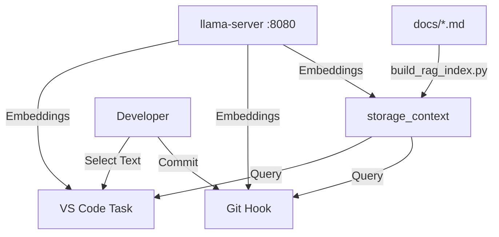

# Estado del Proyecto: Optimización de Embeddings y RAG Local

> **Última Actualización:** 2026-01-17
> **Objetivo Actual:** Consolidar pipeline RAG para asistencia al desarrollo. - **COMPLETADO**

## 1. Resumen Ejecutivo

El proyecto ha evolucionado de un simple fork de `llama.cpp` a un entorno de desarrollo aumentado por IA (AI-Augmented/RAG). Se ha configurado exitosamente un servidor de embeddings local de alto rendimiento y herramientas de cliente integradas en el flujo de trabajo de Git y VS Code.

## 2. Hitos Recientes

### ✅ A. Migración de Modelo (DONE)

- **Anterior:** `nomic-embed-text-v1.5` (Lento en español).
- **Actual:** `snowflake-arctic-embed-m-v2.0-Q4_K_M`.
- **Resultado:** Mejor comprensión semántica multilingüe.

### ✅ B. Optimización del Servidor (DONE)

- **Hardware:** Intel Core i7-1260P / Iris Xe.
- **Backend:** Vulkan (`-DGGML_VULKAN=1`).
- **Tuning:**
  - Contexto: 8192 tokens.
  - Batch Size: **2048** (Crítico para estabilidad).
  - Offload: 99 capas (Full GPU).

### ✅ C. Herramientas RAG (DONE)

- `scripts/build_rag_index.py`: Indexador tolerante a fallos (0% error rate).
- `scripts/ask_local_context.py`: Cliente de búsqueda CLI.
- `scripts/rag_git_check.py`: Hook de pre-commit para documentación proactiva.
- `scripts/prepare_pr_context.py`: Generador de descripciones de PR.

### ✅ D. Integración IDE (DONE)

- **VS Code Tasks:** "Search-on-Write" habilitado vía `.vscode/tasks.json`.

## 3. Arquitectura Actual

## 4. Próximos Pasos (Backlog)

- [ ] **Orquestación de Arranque:** Unificar el arranque del servidor y el entorno en un solo comando (ej: `make dev-env`).
- [ ] **Actualización Automática:** GitHub Action para re-indexar la documentación en CI (si se despliega servidor remoto).
- [ ] **Integración LLM Generativo:** Añadir un segundo modelo (ej: `Llama-3-8B-Q4`) para sintetizar respuestas en lugar de solo mostrar fragmentos (actualmente usamos `MockLLM` para solo retrieval).

## 5. Referencias Rápidas

- **Ver Flujo RAG:** [docs/context/06_RAG_WORKFLOW.md](./06_RAG_WORKFLOW.md)
- **Ver Despliegue:** [docs/context/05_LOCAL_DEPLOYMENT.md](./05_LOCAL_DEPLOYMENT.md)
