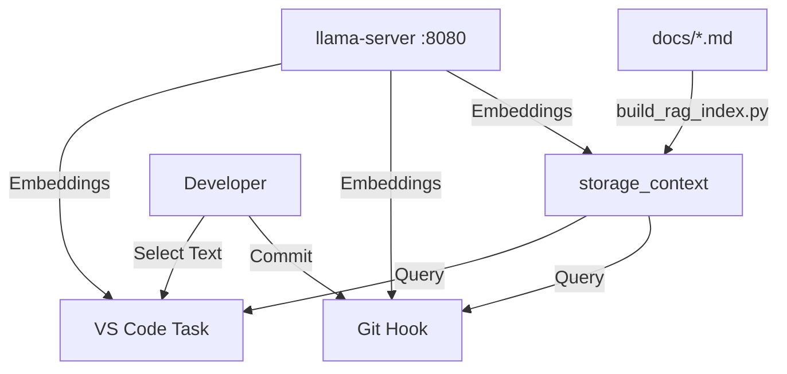

# Estado del Proyecto: Optimización de Embeddings y RAG Local

> **Última Actualización:** 2026-01-17
> **Objetivo Actual:** Consolidar pipeline RAG para asistencia al desarrollo con Nomic v1.5 y aceleración GPU (Iris Xe). - **COMPLETADO**

## 1. Resumen Ejecutivo

El proyecto ha evolucionado de un simple fork de `llama.cpp` a un entorno de desarrollo aumentado por IA (AI-Augmented/RAG). Se ha configurado exitosamente un servidor de embeddings local de alto rendimiento y herramientas de cliente integradas en el flujo de trabajo de Git y VS Code.

## 2. Hitos Recientes

### ✅ A. Migración de Modelo (DONE)

- **Anterior:** `nomic-embed-text-v1.5` (Lento, requiere prefijos, subóptimo en español).
- **Actual:** `snowflake-arctic-embed-m-v2.0-Q4_K_M` (~74 MB).
- **Resultado:**
  - ~1.5-2x más rápido (arquitectura XLM-RoBERTa vs BERT+RoPE).
  - Superior en español (benchmark MIRACL).
  - Sin prefijos requeridos (simplifica indexación).

### ✅ B. Optimización del Servidor (DONE)

- **Hardware:** Intel Core i7-1260P / Iris Xe.
- **Backend:** Vulkan (`-DGGML_VULKAN=1`).
- **Tuning:**
  - Contexto: 8192 tokens.
  - Batch Size: **4096** / Ubatch: **2048** (Optimizado para Nomic).
  - Offload: 99 capas (Full GPU).
  - Rendimiento: Indexación masiva estable sin errores 500.

### ✅ C. Herramientas RAG (DONE)

- `scripts/build_rag_index.py`: Indexador tolerante a fallos (0% error rate).
- `scripts/ask_local_context.py`: Cliente de búsqueda CLI.
- `scripts/rag_git_check.py`: Hook de pre-commit para documentación proactiva.
- `scripts/prepare_pr_context.py`: Generador de descripciones de PR.

### ✅ D. Integración IDE (DONE)

- **VS Code Tasks:** "Search-on-Write" habilitado vía `.vscode/tasks.json`.

## 3. Arquitectura Actual

## 4. Próximos Pasos (Backlog)

- [x] **Orquestación de Arranque:** Unificar el arranque del servidor y el entorno en un solo comando (`make dev-env`).
- [x] **Actualización Automática:** GitHub Action `.github/workflows/reindex_rag.yml` para re-indexar documentación en CI.
- [x] **Integración LLM Generativo:** Añadido soporte para `make chat-server` y `scripts/ask_local_context.py --chat` usando Llama-3.2-3B.

## 5. Referencias Rápidas

- **Comandos Make:** Ejecuta `make help` para ver todas las opciones disponibles.
- **Ver Flujo RAG:** [docs/context/06_RAG_WORKFLOW.md](./06_RAG_WORKFLOW.md)
- **Ver Despliegue:** [docs/context/05_LOCAL_DEPLOYMENT.md](./05_LOCAL_DEPLOYMENT.md)
